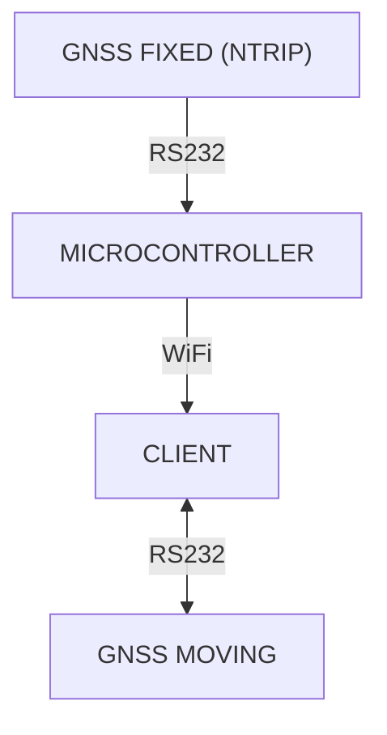

# NTRIP-Server-WiFi-ESP8266

An NTRIP server using WiFi/WebSocket on an ESP8266.

## How It Works

1. Set up your fixed GNSS to send only NTRIP data via RS232 (e.g., CubePilot Here 3/+ with u-blox GNSS).
2. Connect the GNSS to the ESP8266 via the serial interface.
3. Connect your client using WiFi.
4. Open `index.html` in your browser and start the server.
5. Receive data via WebSocket.
6. Forward the NTRIP data to your moving GNSS to obtain centimeter-level positioning data.
7. Visualize the data on a map or other interface.

## Architecture

## History

I needed a fast and affordable way to get GNSS RTK up and running. I decided to use an ESP8266 microcontroller to forward correction data to my [Mini-AI-Car](https://richardreinisch.com/en/dev/ai-car). The data is received via RS232, forwarded to an NVIDIA Jetson Nano using WiFi, and then sent to the onboard GNSS to obtain centimeter-level position data ([NTRIP Client GitHub Repository](https://github.com/richardreinisch/NTRIP-Client-WiFi-WebSocket)).

After testing, I found that this solution works for small distances but I would require approximately 100 meters of range. The D1 Mini Pro ESP8266 offers a wider range, but still not enough. Eventually, I switched to a telemetry radio (sender/receiver) for better performance, requiring only radio and GNSS module configuration and setup.

## Legal Information

- This tool uses `ESPAsyncWebServer-esphome`, `ESPAsyncTCP-esphome`, etc. Refer to their respective licenses for compliance.
- Ensure your use case complies with data protection regulations, particularly when handling sensitive or personal information.
- The authors provide no warranty and assume no liability for any issues arising from the use of this tool.

